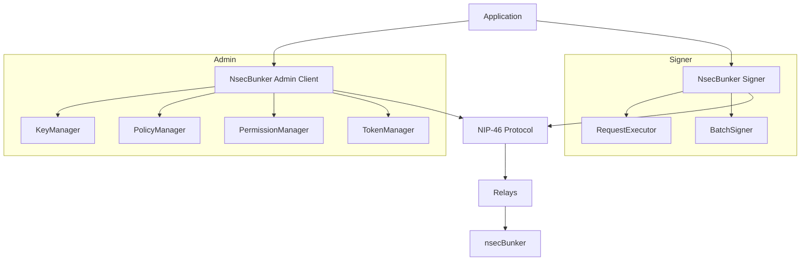

# Architecture Overview

## Modules
- `nsecbunker-admin`: admin ops over NIP-46 (kind 24134)
- `nsecbunker-client`: remote signer, batching, request queue/executor
- `nsecbunker-account`: account/NIP-05/wallet stubs
- `nsecbunker-spring-boot-starter`: auto-config, health/info

## Cross-Cutting
- Models in `nsecbunker-core`
- Connection utilities in `nsecbunker-connection`
- Protocol helpers in `nsecbunker-protocol`
